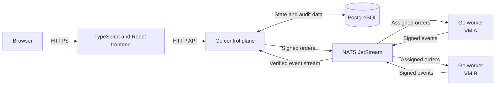

<p align="center">
  
</p>

# Glyphflow

Glyphflow is an open-source platform for script orchestration across servers and virtual machines.

The platform has one central control plane and many remote workers. The control plane schedules work. Workers execute the work.

Glyphflow is an alpha application. The repository contains the Go control plane, Go workers, React frontend, PostgreSQL persistence, and NATS JetStream integration.

## Quick start

Requirements: Docker Compose, Go, Node.js, and npm.

Run the local environment:

```bash
./dev_run.sh
```

The script starts PostgreSQL and NATS, builds the Linux and Windows AMD64 worker binaries, and starts the frontend and control plane.

- Frontend: <http://localhost:5173>
- Control plane: <http://localhost:8080>
- Default email: `admin@example_domain.com`
- Default password: `admin-password-123`

Press `Ctrl-C` to stop the development processes. Docker volumes keep PostgreSQL and NATS data between runs.

## MVP boundary

The first release is one control-plane executable, one NATS JetStream deployment, and any number of outbound-only workers. PostgreSQL remains private to the control plane. Scheduler, dispatcher, event ingestion, HTTP API, housekeeping, and notifications run in the same control-plane process.

Service splitting is deferred until measured scaling, deployment, or ownership needs justify it.

## Goals

Glyphflow will provide these functions:

- Define scheduled and manual tasks through a web application.
- Assign each task run to an authorized worker.
- Deliver tasks through a durable queue.
- Execute commands on remote virtual machines.
- Show task state, history, and audit events.
- Recover safely after database, queue, worker, or network failures.
- Keep database credentials inside the control plane.
- Authenticate and sign all control plane and worker communication.

## Architecture



PostgreSQL is the source of truth. NATS JetStream delivers orders and worker events.

The frontend communicates only with the Go API. Workers do not communicate with the frontend or PostgreSQL.

## Authentication environment

The bootstrap administrator is created only when both `GLYPHFLOW_BOOTSTRAP_EMAIL` (an email address) and `GLYPHFLOW_BOOTSTRAP_PASSWORD` are set. If either is missing, no bootstrap administrator is created.

`GLYPHFLOW_SYSTEM_ADMINS` accepts unique administrator emails separated by spaces, commas, or semicolons. Matching users receive the immutable `admin` role and cannot be disabled or demoted.

`./dev_run.sh` defaults to `admin@example_domain.com` with password `admin-password-123` and includes that email in `GLYPHFLOW_SYSTEM_ADMINS`.

## Components

| Component | Technology | Responsibility |
|---|---|---|
| Frontend | TypeScript and React | Manage tasks, workers, schedules, runs, and audit history. |
| Control plane | Go | Provide the API, schedule runs, produce orders, verify events, and update state. |
| Database | PostgreSQL | Store task definitions, runs, keys, leases, outbox records, and audit events. |
| Message queue | NATS with JetStream | Store and deliver orders and worker events. |
| Worker | Go executable | Verify orders, execute commands, and publish signed lifecycle events. |
| Worker state | SQLite | Store accepted orders and events that await publication. |

The first release will use one control plane executable. Separate services can be added only when operational needs require them.

The frontend will start from the default TypeScript and React project structure. It will not require a custom frontend framework.

## Task flow

1. A user creates a task in the web application.
2. The Go API stores the task definition in PostgreSQL.
3. The producer detects a due task and selects an active worker.
4. One transaction creates the task run and its outbox record.
5. The dispatcher signs the order and publishes it to JetStream.
6. The assigned worker verifies and stores the order.
7. The worker executes the command without a shell.
8. The worker publishes signed lifecycle events.
9. The control plane verifies each event and updates the task run.
10. The frontend shows the current state and complete event history.

## Delivery model

Glyphflow will use at-least-once delivery. A queue or service restart can deliver the same message again.

Each order will have a unique message identifier. Each event will have a unique event identifier.

Workers will store accepted message identifiers. The control plane will store accepted event identifiers.

Glyphflow will not promise exactly-once command execution. Arbitrary commands can create external effects that the platform cannot reverse.

Automatic retry will require an explicit retry-safe policy. A retry will use a new attempt number and lease token.

## Security model

- Workers will make outbound network connections only.
- Workers will not contain PostgreSQL credentials or a PostgreSQL client.
- Mutual TLS will protect queue connections.
- Queue permissions will limit each worker to its own subjects.
- Ed25519 signatures will protect orders and events end to end.
- The worker will verify an order before it parses or executes the payload.
- Each worker will generate its private keys on its target machine.
- A one-use enrollment token will expire after 15 minutes by default.
- Commands will use argument arrays instead of shell command strings.
- Workers will restrict working directories, process resources, and output size.
- Logs will not contain private keys, tokens, or secret values.

A valid signature proves the message source. It does not prove that a compromised worker reports correct results.

## Open-source policy

Glyphflow will use open-source components with approved licenses. The preferred license is MIT.

The project will also permit Apache-2.0, BSD, ISC, the PostgreSQL License, and public-domain software.

Each release will include SPDX license information and a software bill of materials. The required deployment will not depend on proprietary services.

## Project structure

```text
backend/    Go control plane and worker source
frontend/   Default TypeScript and React application
internal/   Design documents, migration notes, and project roadmap
```

## Roadmap

The complete implementation plan is in [`internal/v2-review/TODO.md`](internal/v2-review/TODO.md).

The roadmap follows the network scheduler migration design from the local script scheduler.

## License

Glyphflow uses the MIT License. See [LICENSE](LICENSE).
