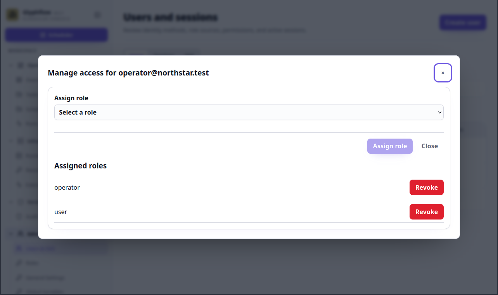

# Manage access

This flow demonstrates least-privilege administration with the fake
`operator@northstar.test` account.

## Flow

1. Sign in as the fake administrator `owner@northstar.test`.
2. Open **Users and sessions** and create or open `operator@northstar.test`.
3. Use **Manage access** to assign the system `operator` role.
4. Sign out and sign in as the fake operator.
5. Confirm the operator can view and execute operational work.
6. Confirm administrator-only pages such as **Roles**, **SSO**, and audit
   administration are unavailable to the operator.
7. Sign back in as the administrator and revoke the operator role.

Use only the fake credentials from the demonstration-data workflow. Do not
include passwords or session tokens in screenshots.

## Screenshots

This illustrative mockup shows the fake operator role and permission summary.
