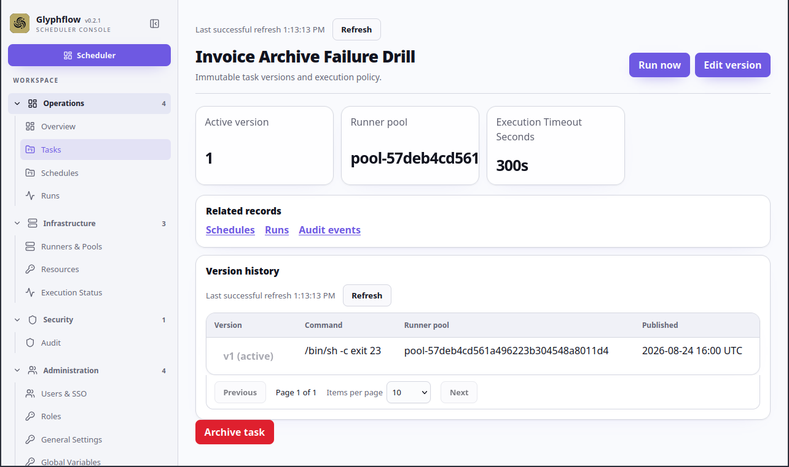

# Handle a failed run

This flow uses the fake `Invoice Archive Failure Drill` task. Its command is
`/bin/sh`, `-c`, `exit 23`, entered as three separate arguments.

## Flow

1. Create or open `Invoice Archive Failure Drill`.
2. Confirm **Maximum attempts** is `2` and the command arguments are separate.
3. Start a manual run.
4. Open the run details after the attempt finishes.
5. Confirm the state is `FAILED`, the exit code is `23`, and the attempt log is
   available.
6. Select **Retry**, confirm that repeating the command is safe, enter the
   fake reason `documentation retry`, and confirm the action.
7. Inspect the attempt history and the new `RETRY` trigger.

The command is intentionally harmless and always fails. Never use a real
failure command or real destination in a screenshot example.

## Screenshots

This illustrative mockup shows the failed result, exit code, and retry reason.
