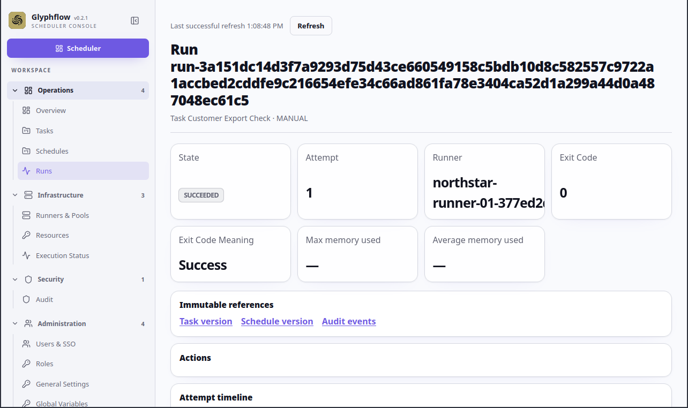

# Create and inspect a first task

This flow shows the shortest useful path through Glyphflow: enroll a runner,
publish a task, start it manually, and inspect its result.

Use a fresh local database seeded only with fake data.

## Example data

| Field | Value |
| --- | --- |
| Runner pool | `Northstar Linux` |
| Runner | `northstar-runner-01` |
| Task | `Customer Export Check` |
| Command | `/bin/echo` |
| Argument | `customer-export-complete` |

## Flow

1. Open the local Glyphflow console and sign in with the local development account.
2. Open **Runners → Enroll runner**.
3. Select `Northstar Linux`, Linux, AMD64, and **Headless**.
4. Download the one-use binary and run it on the local target machine.
5. Wait for `northstar-runner-01` to show **Online**.
6. Create `Customer Export Check` and enter `/bin/echo` and `customer-export-complete` as separate command arguments.
7. Publish the task version.
8. Start a manual run and open the run details.
9. Confirm the run completes and inspect the attempt, state events, and output log.

## Expected result

The run completes on `northstar-runner-01`. The output contains
`customer-export-complete`, and the run history identifies the task version,
runner, attempt, and final exit code.

## Screenshots

This illustrative mockup uses fake names and data only.
