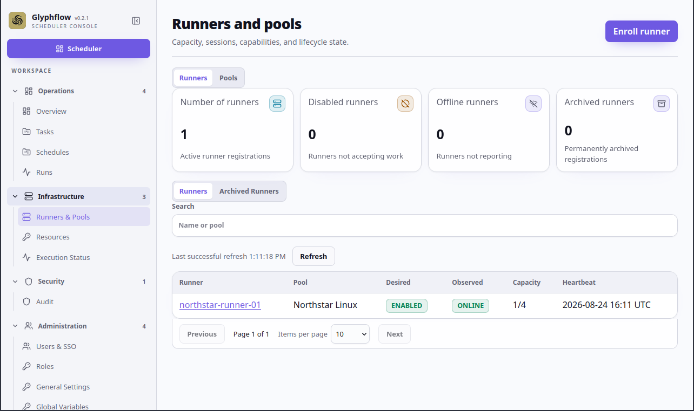

# Place work on the right runner

This flow demonstrates pool, capability, and resource-aware placement with the
fake `Warehouse Snapshot` task.

## Flow

1. Open the `Warehouse Snapshot` task and confirm its active version uses the
   `Northstar Linux` pool.
2. Confirm its tags require `platform=linux` and `architecture=amd64`.
3. Confirm it requires the exclusive `warehouse-report-lock` resource.
4. Start a manual run.
5. Open the run details and inspect the selected runner and resource lease.
6. Confirm the run executes on `northstar-runner-01` only while the runner is
   online, enabled, capable, and below capacity.

## Screenshots

This illustrative mockup shows the selected runner and active resource lease.
