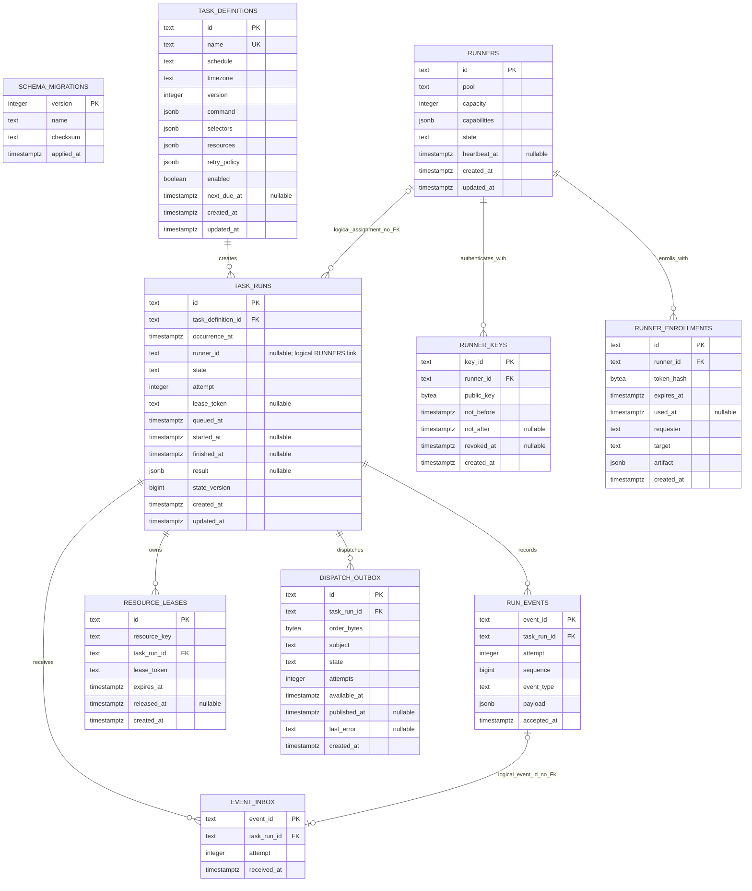
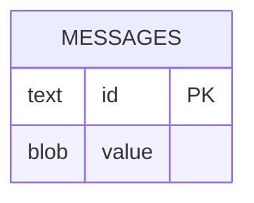

# Glyphflow v0 ER diagram

This diagram describes the storage that the current backend creates. PostgreSQL holds control-plane state. Each worker has a separate SQLite database.

## PostgreSQL control plane

`SCHEMA_MIGRATIONS` is independent. The migration runner creates it before it applies the versioned schema.

## Worker SQLite

`MESSAGES.id` stores an accepted order ID. `MESSAGES.value` stores its JSON state. The table has no relational links because each worker database is local.

## Constraints and logical links

- `TASK_RUNS` permits one occurrence per `(task_definition_id, occurrence_at)`.
- `RUN_EVENTS` permits one event per `(task_run_id, attempt, sequence)`. A trigger makes the table append-only.
- `RUNNER_ENROLLMENTS` permits one unused enrollment per runner.
- `RESOURCE_LEASES` permits one unreleased lease per resource key.
- `TASK_RUNS.runner_id` logically refers to `RUNNERS.id`, but PostgreSQL does not enforce this relation.
- `EVENT_INBOX.event_id` logically matches `RUN_EVENTS.event_id`, but PostgreSQL does not enforce this relation.
- Task run states are `queued`, `dispatched`, `accepted`, `running`, `completed`, `failed`, `timed_out`, `cancelled`, and `lost`.
- Runner states are `enrolling`, `active`, `offline`, `disabled`, and `revoked`.
- Run event types are `accepted`, `rejected`, `started`, `heartbeat`, `completed`, `failed`, `timed_out`, and `cancelled`.
- Dispatch outbox states are `pending`, `published`, and `failed`.

The audit JSON file, replay log, NATS JetStream messages, and imported legacy SQLite tables are not relational application entities. The current command entry points also do not connect the PostgreSQL schema to the HTTP server or worker process.
