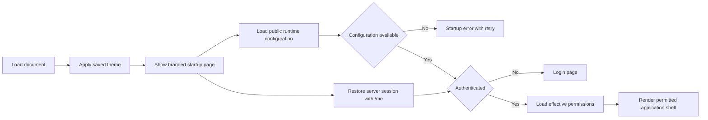

# Glyphflow v1 frontend analysis

Analysis date: 2026-08-13

## Result

Glyphflow should reuse the AI Platform visual language and management-page patterns.

Do not copy the reference application as a complete frontend base.

Its Cloudflare SSR setup, chat stores, mock-data mode, and large component catalog do not serve the scheduler.

Keep the current Vite and React application.

Add one SPA router, TanStack Query, and a small set of local UI components. Use CSS variables for the theme.

The target application should have:

- A branded startup page that validates configuration and restores the server session.
- A full-height shell with one collapsible desktop sidebar and one mobile drawer.
- Permission-aware navigation for tasks, schedules, runs, runners, resources, audit records, and administration.
- Compact page headers, metric cards, filter bars, responsive tables, status pills, empty states, and retry states.
- Password and generic OIDC login through secure server cookies.
- Safe task editing, run control, and live execution-log views.

## Scope and verification

The analysis covered these reference areas:

- Startup and routing in `src/start.ts`, `src/server.ts`, `src/router.tsx`, and `src/routes/__root.tsx`.
- Login, registration, and OIDC callback routes.
- `AppSidebar`, `AdminSidebar`, `AdminPanel`, and representative admin routes.
- The API client, authentication store, runtime configuration, query wrappers, and global styles.
- Loading, error, empty, table, pagination, theme, and mobile helpers.
- The reference package and Vite configuration.

The analysis compared the reference with:

- `local/project-definition.md`.
- `internal/v1/v1-er-diagram-3.md`.
- `internal/v1/REPORT.md` and `internal/v1/TODO.md`.
- The current Go HTTP API and the current `frontend` application.

The reference build could not run because its dependencies are not installed.

The build command stopped because `vite` was unavailable. Source tracing still exposed the application flow and static defects.

## Current Glyphflow frontend

The current frontend is only a Vite placeholder.

| Area | Current state | Required state |
|---|---|---|
| Application | One heading and one paragraph | Routed scheduler console |
| Routing | None | Public, authenticated, and permission-protected routes |
| API access | None | Typed request layer with session recovery and errors |
| Authentication | None | Password, OIDC, logout, callback, and session restore |
| Authorization | None | Route, navigation, and action checks from effective permissions |
| Layout | Centered document | Full-height sidebar and content shell |
| Loading | None | Startup, route, section, mutation, and stream states |
| Error handling | None | Startup, route, request, validation, and conflict states |
| Scheduler pages | None | Tasks, schedules, runs, runners, resources, logs, and audit |
| Administration | None | Users, roles, SSO, sessions, and authentication settings |
| Tests | Build only | Component and workflow coverage for critical operations |

The Go API is also a blocker. It still uses one static bearer token.

Most management routes return `501 Not Implemented`. The frontend must follow the v1 API contract, not the current stubs.

## Reference application flow

### Startup

The reference uses TanStack Start and Cloudflare SSR.

1. `RootShell` inserts a theme script before the application renders.
2. The script reads the saved theme and updates the root element.
3. `QueryClientProvider` and `I18nProvider` wrap all routes.
4. `RootApp` reads the locally stored user and runtime configuration.
5. Public routes render without the application sidebar.
6. Authenticated routes render either the user sidebar or admin sidebar.
7. Admin routes wait for the `admin-panel.view` permission.

The early theme script is useful. It prevents a light-theme flash before React starts.

Cloudflare SSR is not useful for Glyphflow v1. The scheduler is an authenticated operations console. It does not need search indexing or server-rendered public pages.

### Authentication

The reference supports password login and generic OIDC providers.

- Public runtime configuration controls password login and registration.
- The login route loads enabled OIDC providers.
- Password login and OIDC callback both create the same local user shape.
- API requests include cookies.
- A failed authenticated request makes one shared refresh request.
- A failed refresh clears local state and redirects to login.
- The user settings view can list sessions and linked OIDC accounts.

This is the correct product model for Glyphflow. The v1 database design already supports it.

The reference session bootstrap is not safe enough to copy.

It treats a local-storage user as the initial authentication signal. It does not validate that user with `/me` before private rendering.

Glyphflow should use this startup sequence:

Do not store access tokens, refresh tokens, or trusted identity claims in local storage.

Keep the current profile and permissions in memory. Let `HttpOnly` cookies carry the session.

### API and data loading

The reference API client provides useful shared behavior:

- URL and query construction.
- JSON body and response handling.
- One structured API error type.
- Cookie credentials.
- One in-flight refresh promise for concurrent `401` responses.
- One retry after a successful refresh.
- Stream response handling.

The reference uses TanStack Query for runtime configuration, permissions, and admin data. A 30-second stale period reduces duplicate requests.

Glyphflow should reuse this model with fewer wrappers. One request function and direct query hooks are enough.

### Layout

The reference shell uses `100dvh` and prevents document-level scrolling. The sidebar and main panel manage their own overflow.

The desktop sidebar has:

- A logo, product name, and short context label.
- Grouped navigation with active-route styling.
- Collapsible groups.
- A footer with data-source information.
- A user card, settings action, and logout action.
- A full sidebar collapse button.

The management pages use:

- A title, description, status badge, and page actions.
- Metric cards for important counts and state.
- Filter controls above data tables.
- Horizontal table overflow.
- Status pills with text labels.
- Explicit empty, loading, and error blocks.
- Small confirmation dialogs for destructive actions.

These patterns fit a scheduler well.

### Theme and visual system

The reference uses Tailwind CSS variables and semantic color tokens. It defines background, foreground, cards, borders, actions, status colors, sidebar colors, radius, and shadows.

It provides light, dark, and neon themes. It also uses a restrained radial background and one brand gradient.

Glyphflow should start with light and dark themes.

Keep the token contract compatible with a future third theme. Do not build the neon theme in the first delivery.

Use `glyphflow:` storage keys. Do not reuse the reference `ai-factory:` keys.

## Available reference features

| Capability | Impact / Severity Level | Evidence | Suggested modification |
|---|---|---|---|
| Pre-paint theme script | Medium | `src/routes/__root.tsx` | Rename storage keys and retain the early theme update |
| Full-height shell | High | `src/routes/__root.tsx` | Reuse the layout with a responsive mobile drawer |
| Grouped sidebar | High | `AdminSidebar.tsx` | Map groups to scheduler routes and permissions |
| Page and metric components | Medium | `AdminPanel.tsx` | Keep a smaller local component set |
| Table and filter patterns | High | Admin route files | Move filtering and pagination to the server |
| Query cache | High | `runtime-config.ts` and `admin-data.ts` | Reuse direct queries without fallback data |
| Shared API error | High | `api-client.ts` | Map stable Glyphflow error codes and field errors |
| Single refresh promise | Critical | `api-client.ts` | Reuse the race guard with server session validation |
| Public runtime configuration | High | `runtime-config.ts` | Return only safe authentication and brand settings |
| OIDC completion page | High | OIDC callback routes | Keep pending, success, and error states |
| Loading and empty states | Medium | `AdminPanel.tsx` | Use distinct startup, section, and empty states |

## Security risks and patches

| Impact / Severity Level | Description | Evidence | Suggested modification |
|---|---|---|---|
| Critical | Local storage acts as the initial user source | `src/lib/auth-store.ts` | Restore `/me` before private rendering |
| Critical | The request client sends no CSRF token | `src/lib/api-client.ts` | Add the server-issued CSRF header to unsafe cookie requests |
| High | Provider image URLs can load third-party content | `src/routes/login.tsx` | Use local icons or an explicit same-origin image policy |
| High | Mock mode starts when the API URL is absent | `src/lib/data-source.ts` | Fail visibly outside tests and component fixtures |
| Critical | Permission checks cover only the admin shell | `src/routes/__root.tsx` | Check every route and action against one permission key |

Frontend checks do not replace backend authorization. The Go API must return `401` for an invalid session and `403` for a missing permission.

## Potential bugs and edge cases

| Impact / Severity Level | Description | Evidence | Suggested modification |
|---|---|---|---|
| Critical | Route guards run after render | `src/routes/__root.tsx` | Block routes during session and permission checks |
| High | Login never consumes its `redirect` query | `auth-store.ts` and `login.tsx` | Validate and restore one same-origin relative path |
| High | The fixed sidebar ignores the mobile hook | Sidebar components | Use a modal drawer below 768 pixels |
| High | Admin queries expose fallback data during failure | `src/lib/admin-data.ts` | Render data only after success |
| High | The OIDC link challenge has a duplicate `query` property | `src/lib/api-client.ts` | Implement one typed request object |
| Medium | Loading states are mostly text blocks | Root and admin components | Use a stable startup page and section skeletons |
| Medium | Query retries are disabled everywhere | Query hooks | Retry safe reads once and show a retry action |
| Low | The sidebar collapse state resets on reload | `src/routes/__root.tsx` | Persist only the desktop collapse preference |

## Complexity to avoid

The reference declares 63 runtime dependencies and contains a broad UI component catalog. Most of it supports chat, charts, rich text, carousels, and integrations.

Glyphflow does not need:

- TanStack Start or Cloudflare SSR.
- Chat, Markdown, AI SDK, motion, chart, carousel, or rich prompt packages.
- All shadcn components.
- A generated file-route tree.
- A production mock-data switch.
- A separate admin shell and user shell.
- A full translation system before translation is a product requirement.

Use one sidebar. Add an Administration group only when the user has one related permission.

## Potential new features

| Impact / Severity Level | Description | Evidence | Suggested modification |
|---|---|---|---|
| Critical | Glyphflow has no authenticated startup flow | `frontend/src/App.tsx` | Add runtime configuration, session restore, and a startup page |
| High | Glyphflow has no scheduler console | `frontend/src/App.tsx` | Add permission-aware scheduler routes and one shared shell |
| High | Glyphflow has no task or run workflow | Project definition and v1 ER diagram | Add task, schedule, run, attempt, event, and log pages |
| High | Glyphflow has no runner workflow | Project definition and v1 ER diagram | Add runner, pool, session, key, and enrollment pages |
| High | Glyphflow has no RBAC administration | v1 report permission catalog | Add user, role, SSO, session, and authentication pages |
| Medium | Glyphflow has no audit view | Project definition | Add a filtered and paginated audit page |

## Proposed Glyphflow information architecture

### Navigation

| Group | Route | Purpose | Required permission |
|---|---|---|---|
| Operations | `/` | Operational overview | Authenticated, with permitted widgets only |
| Operations | `/tasks` | Task inventory and versions | `tasks.read` |
| Operations | `/schedules` | Schedule inventory and next occurrences | `tasks.read` |
| Operations | `/runs` | Active and historical runs | `runs.read` |
| Infrastructure | `/runners` | Runners, pools, sessions, and enrollment | `runners.read` |
| Infrastructure | `/resources` | Exclusive resource inventory | `resources.read` |
| Security | `/audit` | User and system audit events | `audit.read` |
| Administration | `/admin/users` | Users, roles, identities, and sessions | `users.read` |
| Administration | `/admin/roles` | System and custom roles | `roles.read` |
| Administration | `/admin/sso` | OIDC providers and group mappings | `sso.read` |
| Administration | `/admin/authentication` | Password, registration, and default-role settings | `auth.settings.manage` |
| Account | `/account` | Profile, password, linked SSO, and owned sessions | Authenticated |

Create, edit, and destructive actions need their matching manage permission. Read permission alone must never reveal an active control.

### Overview

The overview should show only data that the user can read.

Recommended widgets are:

- Running, waiting, retrying, failed, and unknown runs.
- Schedules due soon and schedules with a missed-fire problem.
- Online, draining, offline, and full runners.
- Active resource leases.
- Recent failed or unknown runs.
- Recent audit events when `audit.read` is present.

Do not load hidden widget data. This prevents unnecessary `403` responses and reduces API work.

### Tasks and schedules

The task list should show name, enabled state, active version, runner pool, timeout, schedules, and latest run state.

The editor should use clear sections:

1. Identity and enabled state.
2. Command argument array and working directory.
3. Environment variables and secret references.
4. Runner pool, optional pinned runner, and placement selectors.
5. Timeout, output limit, and retry policy.
6. Exclusive resources and self-blocking behavior.
7. Ambiguous-result policy.
8. Review of the new immutable version.

Do not use a shell-like command string. Render each command argument as a separate field.

The schedule editor should preview the next occurrences in the selected time zone. It must explain misfire, deadline, concurrency, and catch-up policies in plain language.

### Runs and logs

The run list should show task, trigger, schedule time, state, attempt, runner, queue age, duration, and result.

The run detail should show:

- Immutable task and schedule version links.
- Current run state and allowed actions.
- Attempt history with runner session and timestamps.
- Ordered state-event timeline.
- Separate stdout and stderr log streams.
- Resource leases and fencing tokens without secret values.
- Cancellation, retry, or reconciliation controls when permitted.

`UNKNOWN` must be visually distinct from `FAILED`. It needs a warning that an external effect may have occurred.

Use a same-origin HTTP stream for live logs. The browser must never connect to NATS.

### Runners and resources

The runner list should show desired state, observed state, pool, capacity, active attempts, heartbeat age, version, platform, and key status.

Runner detail should include sessions, pool membership, capabilities, recent attempts, keys, and enrollment history.

Enrollment artifacts need a clear expiry warning. Download responses must remain `no-store`.

The resource list should show enabled state, current holder, lease expiry, fencing counter, and affected task versions.

### Administration

The role editor should select from seeded permission keys. It must not create permission keys.

System roles should be read-only. Custom roles can change a name, description, and permission set.

User assignments should show a system, administrator, or SSO group source.

The user view should show status, login methods, effective roles, effective permissions, and active sessions. It should support permitted session revocation.

The SSO view should manage providers, secret references, callback URLs, claim mappings, and group-role mappings. It must never display a resolved client secret.

## Loading model

Use five distinct loading states.

| State | UI behavior |
|---|---|
| Startup | Full-page logo, spinner, and `Starting Glyphflow` status |
| Route | Keep the shell visible and show the destination page skeleton |
| Section | Preserve the card or table shape while data loads |
| Mutation | Disable only affected controls and show an action verb |
| Stream | Keep existing logs visible and show connection state |

The startup page should wait for runtime configuration and session restoration. It should not wait for every dashboard query.

Use `role="status"` and `aria-live="polite"` for loading text. Respect reduced-motion settings.

## Error model

| Condition | Required behavior |
|---|---|
| API URL or runtime configuration missing | Blocking startup error with retry and deployment hint |
| Network unavailable | Preserve the shell and data, show a reconnect banner |
| `401` | Attempt one session refresh, then return to login |
| `403` | Show a forbidden page and remove unauthorized actions |
| `404` | Show a not-found page with a safe return link |
| `409` | Explain the state or version conflict and reload current data |
| `422` | Place field errors beside the related inputs |
| `429` | Disable repeat submission and show when retry is allowed |
| `5xx` | Show a retry action and correlation ID when available |
| Log stream interrupted | Keep received output and offer reconnect |

Never replace an error with an empty collection or zero metric.

## Security requirements

- Use `HttpOnly`, `Secure`, and explicit `SameSite` cookies from the backend.
- Send a CSRF token on unsafe cookie-authenticated requests.
- Keep user identity and permissions in memory, not trusted local storage.
- Validate return routes as same-origin relative paths.
- Clear OIDC code and state values from browser history.
- Treat all execution output as text. Never render logs as HTML.
- Do not show resolved secrets in task forms, run details, logs, or audits.
- Confirm cancellation, retry, reconciliation, enrollment reset, and revocation.
- Show why a dangerous action is unavailable.
- Enforce permissions again on every backend request.
- Add a Content Security Policy and frame restrictions at the HTTP boundary.

## Accessibility requirements

- Provide a skip link to the main content.
- Use one visible page heading.
- Use native labels, buttons, tables, and dialogs where possible.
- Keep a visible keyboard focus indicator.
- Make the mobile drawer keyboard and screen-reader accessible.
- Give icon-only buttons an accessible name.
- Do not communicate state by color alone.
- Announce loading, mutation success, and errors.
- Restore focus after dialogs and route changes.
- Keep tables usable through horizontal scrolling.
- Respect reduced motion and text zoom.

## Minimal technical direction

Keep the existing React and Vite setup.

Add only:

- One SPA router for nested layouts and route guards.
- `@tanstack/react-query` for server state.
- `lucide-react` for the reference-style icon language.

Use global CSS variables and a small local component set.

Start with `Button`, `Input`, `Dialog`, `StatusPill`, `PageHeader`, `MetricCard`, and `DataTable`.

Also add `EmptyState`, `ErrorState`, and `LoadingState`.

Use the native platform before another package. Native date, time, select, progress, and dialog controls cover most v1 needs.

Do not generate an API client until the Go API publishes a stable OpenAPI document. Handwritten request and response types are smaller during contract development.

## Backend contracts needed first

The frontend depends on these API groups:

1. Public frontend configuration and enabled OIDC providers.
2. Login, registration, refresh, logout, and OIDC callbacks.
3. Current user, effective permissions, sessions, and linked identities.
4. Task, task-version, schedule, and schedule-preview operations.
5. Run, attempt, event, log-stream, cancel, retry, and reconcile operations.
6. Runner, pool, session, key, and enrollment operations.
7. Resource and lease operations.
8. Audit event operations.
9. User, role, assignment, SSO, and authentication-setting administration.

Each collection needs server-side filtering and cursor or page pagination. Each error response needs a stable code, message, field errors, and correlation ID.

## Recommended delivery order

1. Approve route, permission, error, and API contracts.
2. Add theme tokens, the startup page, request client, and session bootstrap.
3. Add the responsive shell and permission-aware navigation.
4. Build overview, task, schedule, run, runner, resource, and audit read views.
5. Add task editing and operational run actions.
6. Add user, role, SSO, and authentication administration.
7. Add account settings and session management.
8. Add workflow tests, accessibility checks, and production security headers.

The first usable slice should let an authorized user sign in, create a task, create a schedule, run it, and inspect its state and output.
