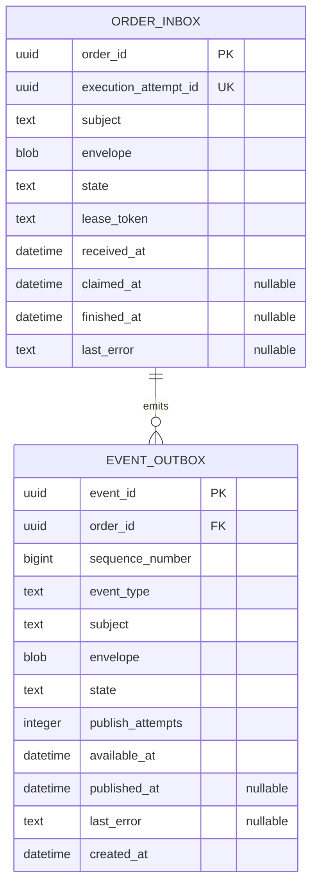
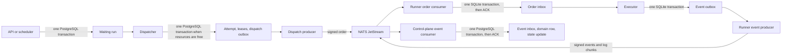

# Glyphflow v1 alpha ER diagram

This model supports scheduled tasks, runner execution, resource locks, self-blocking tasks, RBAC, audits, and streamed execution logs.

PostgreSQL stores control-plane state. Each runner uses a local SQLite database. NATS transports signed orders and events between them.

## PostgreSQL control plane

```mermaid
erDiagram
    ROLES {
        uuid id PK
        text name UK
        text description
        timestamptz created_at
        timestamptz updated_at
    }

    PERMISSIONS {
        uuid id PK
        text name UK
        text description
    }

    ROLE_PERMISSIONS {
        uuid role_id PK, FK
        uuid permission_id PK, FK
        timestamptz created_at
    }

    USERS {
        uuid id PK
        uuid role_id FK
        text email UK
        text display_name
        text password_hash
        boolean is_active
        timestamptz last_login_at "nullable"
        timestamptz created_at
        timestamptz updated_at
    }

    RUNNERS {
        uuid id PK
        text name UK
        text hostname
        text state
        integer capacity
        jsonb capabilities
        text agent_version
        text operating_system
        text architecture
        timestamptz last_seen_at "nullable"
        timestamptz created_at
        timestamptz updated_at
    }

    RUNNER_SESSIONS {
        uuid id PK
        uuid runner_id FK
        text boot_id
        timestamptz connected_at
        timestamptz last_heartbeat_at
        timestamptz disconnected_at "nullable"
    }

    RUNNER_KEYS {
        uuid id PK
        uuid runner_id FK
        bytea public_key
        timestamptz not_before
        timestamptz not_after "nullable"
        timestamptz revoked_at "nullable"
        timestamptz created_at
    }

    RUNNER_ENROLLMENTS {
        uuid id PK
        uuid runner_id FK
        bytea token_hash
        timestamptz expires_at
        timestamptz used_at "nullable"
        uuid created_by FK
        jsonb certificate_artifact
        timestamptz created_at
    }

    TASKS {
        uuid id PK
        text name UK
        text description
        boolean is_enabled
        boolean is_deleted
        uuid created_by FK
        timestamptz created_at
        timestamptz updated_at
    }

    TASK_VERSIONS {
        uuid id PK
        uuid task_id FK
        integer version
        uuid runner_id FK
        jsonb command
        text working_directory
        jsonb environment
        jsonb secret_references
        integer timeout_seconds
        uuid created_by FK
        timestamptz created_at
    }

    SCHEDULES {
        uuid id PK
        uuid task_id FK
        text name
        boolean is_enabled
        timestamptz next_fire_at "nullable"
        uuid created_by FK
        timestamptz created_at
        timestamptz updated_at
    }

    SCHEDULE_VERSIONS {
        uuid id PK
        uuid schedule_id FK
        integer version
        uuid task_version_id FK
        text schedule_type
        text expression
        text timezone
        timestamptz starts_at "nullable"
        timestamptz ends_at "nullable"
        uuid created_by FK
        timestamptz created_at
    }

    RUNS {
        uuid id PK
        uuid task_version_id FK
        uuid schedule_version_id FK "nullable for manual runs"
        uuid triggered_by FK "nullable for scheduled runs"
        text trigger_type
        timestamptz scheduled_for
        timestamptz queued_at
        text state
        text idempotency_key UK
        timestamptz completed_at "nullable"
        timestamptz created_at
        timestamptz updated_at
    }

    EXECUTION_ATTEMPTS {
        uuid id PK
        uuid run_id FK
        integer attempt_number
        uuid runner_id FK
        uuid runner_session_id FK "nullable until accepted"
        text state
        text lease_token UK
        bigint fencing_token
        timestamptz dispatched_at "nullable"
        timestamptz accepted_at "nullable"
        timestamptz started_at "nullable"
        timestamptz last_heartbeat_at "nullable"
        timestamptz lease_expires_at
        timestamptz finished_at "nullable"
        integer exit_code "nullable"
        text termination_reason "nullable"
        jsonb result "nullable"
        timestamptz created_at
        timestamptz updated_at
    }

    RESOURCES {
        uuid id PK
        text name UK
        text kind
        uuid owner_task_id FK "nullable for user resources"
        text description
        boolean is_enabled
        timestamptz created_at
        timestamptz updated_at
    }

    TASK_RESOURCE_REQUIREMENTS {
        uuid task_version_id PK, FK
        uuid resource_id PK, FK
    }

    RESOURCE_LEASES {
        uuid id PK
        uuid resource_id FK
        uuid execution_attempt_id FK
        text lease_token
        bigint fencing_token
        timestamptz acquired_at
        timestamptz expires_at
        timestamptz released_at "nullable"
    }

    DISPATCH_OUTBOX {
        uuid message_id PK
        uuid execution_attempt_id FK
        text message_type
        text subject
        bytea envelope
        text state
        integer publish_attempts
        timestamptz available_at
        timestamptz published_at "nullable"
        text last_error "nullable"
        timestamptz created_at
    }

    EVENT_INBOX {
        uuid event_id PK
        uuid execution_attempt_id FK
        bigint sequence_number
        text event_type
        text subject
        bytea envelope
        timestamptz received_at
    }

    RUN_EVENTS {
        uuid event_id PK, FK
        jsonb payload
        timestamptz accepted_at
    }

    EXECUTION_LOG_CHUNKS {
        uuid event_id PK, FK
        text stream
        bytea payload
        integer size_bytes
        timestamptz observed_at
    }

    AUDIT_EVENTS {
        uuid id PK
        uuid actor_user_id FK "nullable for system actions"
        timestamptz occurred_at
        text http_method
        text request_path
        text action
        text object_type
        uuid object_id "nullable"
        text request_id
        text correlation_id
        text source_ip
        jsonb before_value "nullable"
        jsonb after_value "nullable"
        text result
        jsonb metadata
    }

    ROLES ||--o{ USERS : assigned_to
    ROLES ||--o{ ROLE_PERMISSIONS : grants
    PERMISSIONS ||--o{ ROLE_PERMISSIONS : included_in

    USERS ||--o{ TASKS : creates
    USERS ||--o{ TASK_VERSIONS : creates
    USERS ||--o{ SCHEDULES : creates
    USERS ||--o{ SCHEDULE_VERSIONS : creates
    USERS ||--o{ RUNNER_ENROLLMENTS : creates
    USERS o|--o{ RUNS : triggers
    USERS o|--o{ AUDIT_EVENTS : acts

    RUNNERS ||--o{ RUNNER_SESSIONS : opens
    RUNNERS ||--o{ RUNNER_KEYS : authenticates_with
    RUNNERS ||--o{ RUNNER_ENROLLMENTS : enrolls_with
    RUNNERS ||--o{ TASK_VERSIONS : assigned_to
    RUNNERS ||--o{ EXECUTION_ATTEMPTS : receives
    RUNNER_SESSIONS o|--o{ EXECUTION_ATTEMPTS : executes

    TASKS ||--o{ TASK_VERSIONS : versions
    TASKS ||--o{ SCHEDULES : schedules
    SCHEDULES ||--o{ SCHEDULE_VERSIONS : versions
    TASK_VERSIONS ||--o{ SCHEDULE_VERSIONS : selects
    TASK_VERSIONS ||--o{ RUNS : snapshots
    SCHEDULE_VERSIONS o|--o{ RUNS : creates
    RUNS ||--o{ EXECUTION_ATTEMPTS : retries_as

    TASK_VERSIONS ||--o{ TASK_RESOURCE_REQUIREMENTS : requires
    TASKS o|--o{ RESOURCES : owns_self_block_guard
    RESOURCES ||--o{ TASK_RESOURCE_REQUIREMENTS : required_resource
    RESOURCES ||--o{ RESOURCE_LEASES : leased_resource
    EXECUTION_ATTEMPTS ||--o{ RESOURCE_LEASES : holds

    EXECUTION_ATTEMPTS ||--o{ DISPATCH_OUTBOX : dispatches
    EXECUTION_ATTEMPTS ||--o{ EVENT_INBOX : receives
    EVENT_INBOX ||--o| RUN_EVENTS : records_state
    EVENT_INBOX ||--o| EXECUTION_LOG_CHUNKS : records_output
```

## Runner SQLite

Each runner owns this database. The NATS order consumer, executor, and NATS event producer can run as separate processes.

## Durable message flow

## Required invariants

- Keep task and schedule versions immutable.
- Enforce `UNIQUE (task_id, version)` on task versions.
- Enforce `UNIQUE (schedule_id, version)` on schedule versions.
- Enforce `UNIQUE (schedule_version_id, scheduled_for)` for scheduled runs.
- Enforce `UNIQUE (run_id, attempt_number)` on execution attempts.
- Enforce `UNIQUE (execution_attempt_id, sequence_number)` on the event inbox.
- Enforce `UNIQUE (order_id, sequence_number)` on the runner event outbox.
- Require each schedule version and run to reference a task version from the same task.
- Enforce positive task timeouts and fencing tokens.
- Permit at most one unreleased lease per resource.
- Permit at most one system-managed self-blocking resource per task.
- Create the attempt, resource leases, and dispatch outbox row in one dispatch transaction.
- Use `message_id` and `event_id` as NATS deduplication IDs.
- Acknowledge each NATS message only after its target database transaction commits.
- Represent self-blocking with one system-managed exclusive resource per task.
- Attach the same self-blocking resource to every version of its task.
- Store non-secret environment values in `environment`. Store only secret references in `secret_references`.
- Require each event inbox row to create either one run event or one execution log chunk.

Notifier, telemetry, global configuration, approvals, and object storage are outside the alpha scope.
