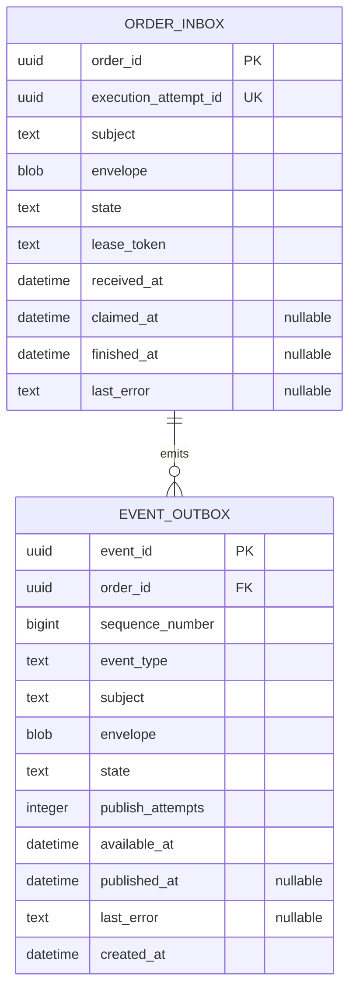
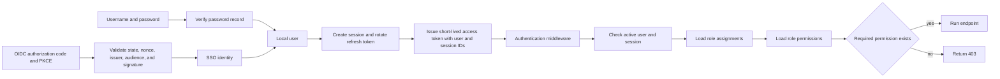
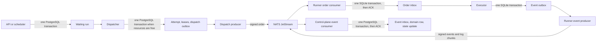

# Glyphflow v1 beta ER diagram

This beta extends the alpha model with password authentication, generic OIDC SSO, sessions, roles, permissions, and seed-owned authorization data.

PostgreSQL stores control-plane and identity state. Each runner uses a local SQLite database. NATS transports signed orders and events.

## PostgreSQL control plane

```mermaid
erDiagram
    USERS {
        uuid id PK
        text username UK
        text email UK "nullable"
        text display_name
        text status
        timestamptz last_login_at "nullable"
        timestamptz created_at
        timestamptz updated_at
    }

    USER_PASSWORDS {
        uuid user_id PK, FK
        text password_hash
        timestamptz password_changed_at
    }

    USER_SESSIONS {
        uuid id PK
        uuid user_id FK
        uuid sso_provider_id FK "nullable"
        text refresh_token_hash UK
        text auth_method
        text device_name "nullable"
        text user_agent "nullable"
        inet ip_address "nullable"
        timestamptz last_used_at
        timestamptz expires_at
        timestamptz revoked_at "nullable"
        timestamptz created_at
    }

    AUTH_SETTINGS {
        smallint id PK "singleton row"
        boolean password_login_enabled
        boolean password_registration_enabled
        uuid default_role_id FK
        uuid updated_by FK "nullable"
        timestamptz updated_at
    }

    SSO_PROVIDERS {
        uuid id PK
        text key UK
        text name
        text issuer
        text client_id
        jsonb scopes
        jsonb redirect_uris
        jsonb claim_mappings
        jsonb group_claim_paths
        text pkce_method
        boolean auto_provision_enabled
        boolean enabled
        timestamptz created_at
        timestamptz updated_at
    }

    SSO_PROVIDER_CREDENTIALS {
        uuid id PK
        uuid provider_id FK
        integer version
        text client_secret_reference
        text status
        timestamptz valid_from
        timestamptz expires_at "nullable"
        timestamptz revoked_at "nullable"
        timestamptz created_at
    }

    USER_SSO_IDENTITIES {
        uuid id PK
        uuid user_id FK
        uuid provider_id FK
        text provider_subject
        text provider_username "nullable"
        text provider_email "nullable"
        timestamptz last_login_at
        timestamptz created_at
        timestamptz updated_at
    }

    SSO_AUTHORIZATION_STATES {
        uuid id PK
        uuid provider_id FK
        uuid user_id FK "nullable for login"
        text state_hash UK
        text purpose
        text redirect_uri
        text nonce
        text code_verifier
        timestamptz expires_at
        timestamptz consumed_at "nullable"
        timestamptz created_at
    }

    ROLES {
        uuid id PK
        text key UK
        text name
        text description
        boolean is_system
        uuid created_by FK "nullable for seeded roles"
        timestamptz created_at
        timestamptz updated_at
    }

    PERMISSIONS {
        uuid id PK
        text key UK
        text resource
        text action
        text description
        timestamptz created_at
        timestamptz updated_at
    }

    ROLE_PERMISSIONS {
        uuid role_id PK, FK
        uuid permission_id PK, FK
        timestamptz created_at
    }

    ROLE_ASSIGNMENTS {
        uuid id PK
        uuid user_id FK
        uuid role_id FK
        text source_type
        text source_key
        uuid sso_provider_id FK "nullable"
        text external_group_id "nullable"
        text external_group_name "nullable"
        uuid assigned_by FK "nullable"
        timestamptz created_at
        timestamptz updated_at
    }

    SSO_GROUP_ROLE_MAPPINGS {
        uuid id PK
        uuid provider_id FK
        text external_group_id
        text external_group_name "nullable"
        uuid role_id FK
        timestamptz created_at
        timestamptz updated_at
    }

    RUNNERS {
        uuid id PK
        text name UK
        text hostname
        text state
        integer capacity
        jsonb capabilities
        text agent_version
        text operating_system
        text architecture
        timestamptz last_seen_at "nullable"
        timestamptz created_at
        timestamptz updated_at
    }

    RUNNER_SESSIONS {
        uuid id PK
        uuid runner_id FK
        text boot_id
        timestamptz connected_at
        timestamptz last_heartbeat_at
        timestamptz disconnected_at "nullable"
    }

    RUNNER_KEYS {
        uuid id PK
        uuid runner_id FK
        bytea public_key
        timestamptz not_before
        timestamptz not_after "nullable"
        timestamptz revoked_at "nullable"
        timestamptz created_at
    }

    RUNNER_ENROLLMENTS {
        uuid id PK
        uuid runner_id FK
        bytea token_hash
        timestamptz expires_at
        timestamptz used_at "nullable"
        uuid created_by FK
        jsonb certificate_artifact
        timestamptz created_at
    }

    TASKS {
        uuid id PK
        text name UK
        text description
        boolean is_enabled
        boolean is_deleted
        uuid created_by FK
        timestamptz created_at
        timestamptz updated_at
    }

    TASK_VERSIONS {
        uuid id PK
        uuid task_id FK
        integer version
        uuid runner_id FK
        jsonb command
        text working_directory
        jsonb environment
        jsonb secret_references
        integer timeout_seconds
        uuid created_by FK
        timestamptz created_at
    }

    SCHEDULES {
        uuid id PK
        uuid task_id FK
        text name
        boolean is_enabled
        timestamptz next_fire_at "nullable"
        uuid created_by FK
        timestamptz created_at
        timestamptz updated_at
    }

    SCHEDULE_VERSIONS {
        uuid id PK
        uuid schedule_id FK
        integer version
        uuid task_version_id FK
        text schedule_type
        text expression
        text timezone
        timestamptz starts_at "nullable"
        timestamptz ends_at "nullable"
        uuid created_by FK
        timestamptz created_at
    }

    RUNS {
        uuid id PK
        uuid task_version_id FK
        uuid schedule_version_id FK "nullable for manual runs"
        uuid triggered_by FK "nullable for scheduled runs"
        text trigger_type
        timestamptz scheduled_for
        timestamptz queued_at
        text state
        text idempotency_key UK
        timestamptz completed_at "nullable"
        timestamptz created_at
        timestamptz updated_at
    }

    EXECUTION_ATTEMPTS {
        uuid id PK
        uuid run_id FK
        integer attempt_number
        uuid runner_id FK
        uuid runner_session_id FK "nullable until accepted"
        text state
        text lease_token UK
        bigint fencing_token
        timestamptz dispatched_at "nullable"
        timestamptz accepted_at "nullable"
        timestamptz started_at "nullable"
        timestamptz last_heartbeat_at "nullable"
        timestamptz lease_expires_at
        timestamptz finished_at "nullable"
        integer exit_code "nullable"
        text termination_reason "nullable"
        jsonb result "nullable"
        timestamptz created_at
        timestamptz updated_at
    }

    RESOURCES {
        uuid id PK
        text name UK
        text kind
        uuid owner_task_id FK "nullable for user resources"
        text description
        boolean is_enabled
        timestamptz created_at
        timestamptz updated_at
    }

    TASK_RESOURCE_REQUIREMENTS {
        uuid task_version_id PK, FK
        uuid resource_id PK, FK
    }

    RESOURCE_LEASES {
        uuid id PK
        uuid resource_id FK
        uuid execution_attempt_id FK
        text lease_token
        bigint fencing_token
        timestamptz acquired_at
        timestamptz expires_at
        timestamptz released_at "nullable"
    }

    DISPATCH_OUTBOX {
        uuid message_id PK
        uuid execution_attempt_id FK
        text message_type
        text subject
        bytea envelope
        text state
        integer publish_attempts
        timestamptz available_at
        timestamptz published_at "nullable"
        text last_error "nullable"
        timestamptz created_at
    }

    EVENT_INBOX {
        uuid event_id PK
        uuid execution_attempt_id FK
        bigint sequence_number
        text event_type
        text subject
        bytea envelope
        timestamptz received_at
    }

    RUN_EVENTS {
        uuid event_id PK, FK
        jsonb payload
        timestamptz accepted_at
    }

    EXECUTION_LOG_CHUNKS {
        uuid event_id PK, FK
        text stream
        bytea payload
        integer size_bytes
        timestamptz observed_at
    }

    AUDIT_EVENTS {
        uuid id PK
        uuid actor_user_id FK "nullable for system actions"
        uuid actor_session_id FK "nullable"
        timestamptz occurred_at
        text http_method
        text request_path
        text action
        text object_type
        uuid object_id "nullable"
        text request_id
        text correlation_id
        inet source_ip "nullable"
        jsonb before_value "nullable"
        jsonb after_value "nullable"
        text result
        jsonb metadata
    }

    USERS ||--o| USER_PASSWORDS : authenticates_with
    USERS ||--o{ USER_SESSIONS : owns
    USERS ||--o{ USER_SSO_IDENTITIES : links
    USERS o|--o{ SSO_AUTHORIZATION_STATES : links_through
    USERS ||--o{ ROLE_ASSIGNMENTS : receives
    USERS o|--o{ ROLE_ASSIGNMENTS : assigns
    USERS o|--o{ ROLES : creates
    USERS o|--o{ AUTH_SETTINGS : updates

    SSO_PROVIDERS ||--o{ SSO_PROVIDER_CREDENTIALS : authenticates_with
    SSO_PROVIDERS ||--o{ USER_SSO_IDENTITIES : identifies
    SSO_PROVIDERS ||--o{ SSO_AUTHORIZATION_STATES : challenges
    SSO_PROVIDERS o|--o{ USER_SESSIONS : starts
    SSO_PROVIDERS o|--o{ ROLE_ASSIGNMENTS : grants
    SSO_PROVIDERS ||--o{ SSO_GROUP_ROLE_MAPPINGS : maps

    ROLES ||--o{ ROLE_PERMISSIONS : grants
    PERMISSIONS ||--o{ ROLE_PERMISSIONS : included_in
    ROLES ||--o{ ROLE_ASSIGNMENTS : assigned_as
    ROLES ||--o{ SSO_GROUP_ROLE_MAPPINGS : mapped_role
    ROLES ||--o| AUTH_SETTINGS : default_role

    USERS ||--o{ TASKS : creates
    USERS ||--o{ TASK_VERSIONS : creates
    USERS ||--o{ SCHEDULES : creates
    USERS ||--o{ SCHEDULE_VERSIONS : creates
    USERS ||--o{ RUNNER_ENROLLMENTS : creates
    USERS o|--o{ RUNS : triggers
    USERS o|--o{ AUDIT_EVENTS : acts
    USER_SESSIONS o|--o{ AUDIT_EVENTS : traces

    RUNNERS ||--o{ RUNNER_SESSIONS : opens
    RUNNERS ||--o{ RUNNER_KEYS : authenticates_with
    RUNNERS ||--o{ RUNNER_ENROLLMENTS : enrolls_with
    RUNNERS ||--o{ TASK_VERSIONS : assigned_to
    RUNNERS ||--o{ EXECUTION_ATTEMPTS : receives
    RUNNER_SESSIONS o|--o{ EXECUTION_ATTEMPTS : executes

    TASKS ||--o{ TASK_VERSIONS : versions
    TASKS ||--o{ SCHEDULES : schedules
    SCHEDULES ||--o{ SCHEDULE_VERSIONS : versions
    TASK_VERSIONS ||--o{ SCHEDULE_VERSIONS : selects
    TASK_VERSIONS ||--o{ RUNS : snapshots
    SCHEDULE_VERSIONS o|--o{ RUNS : creates
    RUNS ||--o{ EXECUTION_ATTEMPTS : retries_as

    TASK_VERSIONS ||--o{ TASK_RESOURCE_REQUIREMENTS : requires
    TASKS o|--o{ RESOURCES : owns_self_block_guard
    RESOURCES ||--o{ TASK_RESOURCE_REQUIREMENTS : required_resource
    RESOURCES ||--o{ RESOURCE_LEASES : leased_resource
    EXECUTION_ATTEMPTS ||--o{ RESOURCE_LEASES : holds

    EXECUTION_ATTEMPTS ||--o{ DISPATCH_OUTBOX : dispatches
    EXECUTION_ATTEMPTS ||--o{ EVENT_INBOX : receives
    EVENT_INBOX ||--o| RUN_EVENTS : records_state
    EVENT_INBOX ||--o| EXECUTION_LOG_CHUNKS : records_output
```

## Runner SQLite

## Authentication and authorization flow

Both login methods create the same local session. Password login can be disabled without removing password records or SSO access.

Routes declare code-owned permission keys. The database stores roles, role assignments, and each role's selected permissions.

## Durable message flow

## Seed catalog

The seed process owns permission keys and system roles. Custom roles can select any seeded permission.

Seed these permissions:

- `users.read`, `users.manage`
- `roles.read`, `roles.manage`
- `sso.read`, `sso.manage`
- `auth.settings.manage`
- `tasks.read`, `tasks.manage`
- `runs.read`, `runs.execute`, `runs.cancel`, `runs.retry`
- `logs.read`
- `resources.read`, `resources.manage`
- `runners.read`, `runners.manage`
- `audit.read`

Seed these system roles:

- `admin` receives every seeded permission.
- `user` is the default role and starts without permissions.

The seed uses stable UUIDs derived from each key. It updates descriptions and system-role grants without changing custom roles.

## Authentication invariants

- Enforce case-insensitive uniqueness for usernames and non-null email addresses.
- Permit zero or one password record per user.
- Permit one SSO identity per `(provider_id, provider_subject)`.
- Permit one SSO identity per `(user_id, provider_id)`.
- Permit one active SSO credential version per provider.
- Store only client-secret references. Do not store raw SSO client secrets.
- Hash passwords with Argon2id and a deployment secret.
- Store only refresh-token hashes and rotate each refresh token after use.
- Put the user ID and session ID in each short-lived access token.
- Check the user status and session status on each authenticated request.
- Load permissions from the database. Do not store permission grants in access tokens.
- Reject password login and password registration when their settings are disabled.
- Require at least one enabled login method before a settings update commits.
- Prevent a user from removing the last available login method.
- Validate OIDC signatures, issuer, audience, expiry, nonce, state, PKCE, and redirect URI.
- Consume each SSO authorization state with one atomic compare-and-swap update.
- Require `UNIQUE (provider_id, version)` on SSO credentials.
- Require `UNIQUE (provider_id, external_group_id, role_id)` on SSO group mappings.
- Require `UNIQUE (user_id, role_id, source_type, source_key)` on role assignments.
- Keep manual and system role assignments when SSO group assignments change.
- Prevent updates and deletion of seeded system roles and seeded permissions.
- Prevent deletion of the last active administrator assignment.
- Require the default role before registration or SSO auto-provision starts.
- Protect unsafe cookie-authenticated requests with an origin check and a CSRF token.

## Scheduler and messaging invariants

- Keep task and schedule versions immutable.
- Enforce `UNIQUE (task_id, version)` on task versions.
- Enforce `UNIQUE (schedule_id, version)` on schedule versions.
- Enforce `UNIQUE (schedule_version_id, scheduled_for)` for scheduled runs.
- Enforce `UNIQUE (run_id, attempt_number)` on execution attempts.
- Enforce `UNIQUE (execution_attempt_id, sequence_number)` on the event inbox.
- Enforce `UNIQUE (order_id, sequence_number)` on the runner event outbox.
- Require each schedule version and run to reference a task version from the same task.
- Permit at most one unreleased lease per resource.
- Create the attempt, resource leases, and dispatch outbox row in one dispatch transaction.
- Acknowledge each NATS message only after its target database transaction commits.
- Represent self-blocking with one system-managed exclusive resource per task.
- Store non-secret environment values in `environment`. Store only secret references in `secret_references`.
- Require each event inbox row to create either one run event or one execution log chunk.

Notifier, telemetry, approvals, and object storage remain outside the beta scope.
