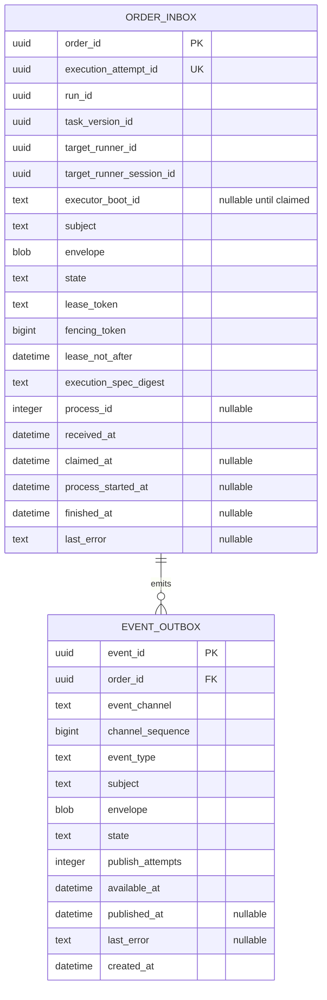
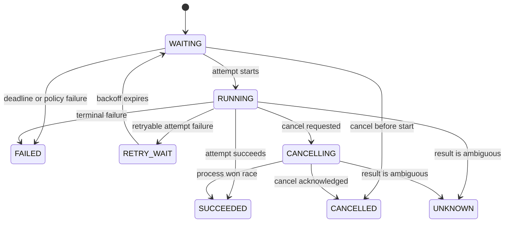
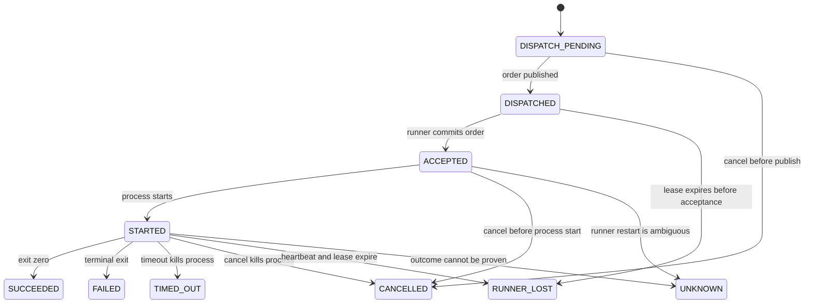

# Glyphflow v1 ER diagram, revision 3

This model supports durable scheduling, dynamic runner placement, explicit recovery policies, password login, generic OIDC SSO, and database-backed RBAC.

PostgreSQL is the control-plane source of truth. Each runner uses local SQLite. NATS JetStream transports signed orders and events.

## PostgreSQL control plane

```mermaid
erDiagram
    USERS {
        uuid id PK
        text username UK
        text email UK "nullable"
        text display_name
        text status
        timestamptz last_login_at "nullable"
        timestamptz created_at
        timestamptz updated_at
    }

    USER_PASSWORDS {
        uuid user_id PK, FK
        text password_hash
        timestamptz password_changed_at
    }

    USER_SESSIONS {
        uuid id PK
        uuid user_id FK
        uuid sso_provider_id FK "nullable"
        text refresh_token_hash UK
        text auth_method
        text device_name "nullable"
        text user_agent "nullable"
        inet ip_address "nullable"
        timestamptz last_used_at
        timestamptz expires_at
        timestamptz revoked_at "nullable"
        timestamptz created_at
    }

    AUTH_SETTINGS {
        smallint id PK "must equal 1"
        boolean password_login_enabled
        boolean password_registration_enabled
        uuid default_role_id FK
        uuid updated_by FK "nullable"
        timestamptz updated_at
    }

    SSO_PROVIDERS {
        uuid id PK
        text key UK
        text name
        text issuer
        text client_id
        jsonb scopes
        jsonb redirect_uris
        jsonb claim_mappings
        jsonb group_claim_paths
        text pkce_method
        boolean auto_provision_enabled
        boolean enabled
        timestamptz created_at
        timestamptz updated_at
    }

    SSO_PROVIDER_CREDENTIALS {
        uuid id PK
        uuid provider_id FK
        integer version
        text client_secret_reference
        text status
        timestamptz valid_from
        timestamptz expires_at "nullable"
        timestamptz revoked_at "nullable"
        timestamptz created_at
    }

    USER_SSO_IDENTITIES {
        uuid id PK
        uuid user_id FK
        uuid provider_id FK
        text provider_subject
        text provider_username "nullable"
        text provider_email "nullable"
        timestamptz last_login_at
        timestamptz created_at
        timestamptz updated_at
    }

    SSO_AUTHORIZATION_STATES {
        uuid id PK
        uuid provider_id FK
        uuid user_id FK "nullable for login"
        text state_hash UK
        text purpose
        text redirect_uri
        text nonce_hash
        bytea encrypted_code_verifier
        timestamptz expires_at
        timestamptz consumed_at "nullable"
        timestamptz created_at
    }

    ROLES {
        uuid id PK
        text key UK
        text name
        text description
        boolean is_system
        uuid created_by FK "nullable for seeded roles"
        timestamptz created_at
        timestamptz updated_at
    }

    PERMISSIONS {
        uuid id PK
        text key UK
        text resource
        text action
        text description
        timestamptz created_at
        timestamptz updated_at
    }

    ROLE_PERMISSIONS {
        uuid role_id PK, FK
        uuid permission_id PK, FK
        timestamptz created_at
    }

    ROLE_ASSIGNMENTS {
        uuid id PK
        uuid user_id FK
        uuid role_id FK
        text source_type
        text source_key
        uuid sso_provider_id FK "nullable"
        text external_group_id "nullable"
        text external_group_name "nullable"
        uuid assigned_by FK "nullable"
        timestamptz created_at
        timestamptz updated_at
    }

    SSO_GROUP_ROLE_MAPPINGS {
        uuid id PK
        uuid provider_id FK
        text external_group_id
        text external_group_name "nullable"
        uuid role_id FK
        timestamptz created_at
        timestamptz updated_at
    }

    CONTROL_PLANE_KEYS {
        text key_id PK
        bytea public_key
        timestamptz not_before
        timestamptz not_after "nullable"
        timestamptz revoked_at "nullable"
        timestamptz created_at
    }

    RUNNER_POOLS {
        uuid id PK
        text name UK
        text description
        boolean is_enabled
        timestamptz created_at
        timestamptz updated_at
    }

    RUNNER_POOL_MEMBERS {
        uuid runner_pool_id PK, FK
        uuid runner_id PK, FK
        timestamptz created_at
    }

    RUNNERS {
        uuid id PK
        text name UK
        text hostname
        text desired_state
        text observed_state
        integer capacity
        jsonb capabilities
        text agent_version
        text operating_system
        text architecture
        timestamptz last_seen_at "nullable"
        timestamptz created_at
        timestamptz updated_at
    }

    RUNNER_SESSIONS {
        uuid id PK
        uuid runner_id FK
        text boot_id
        timestamptz connected_at
        timestamptz last_heartbeat_at
        timestamptz disconnected_at "nullable"
    }

    RUNNER_KEYS {
        text key_id PK
        uuid runner_id FK
        bytea public_key
        timestamptz not_before
        timestamptz not_after "nullable"
        timestamptz revoked_at "nullable"
        timestamptz created_at
    }

    RUNNER_ENROLLMENTS {
        uuid id PK
        uuid runner_id FK
        bytea token_hash
        timestamptz expires_at
        timestamptz used_at "nullable"
        uuid created_by FK
        bytea issued_certificate_chain "nullable"
        timestamptz created_at
    }

    TASKS {
        uuid id PK
        uuid current_version_id FK "nullable during creation"
        text name UK
        text description
        boolean is_enabled
        boolean is_deleted
        uuid created_by FK
        timestamptz created_at
        timestamptz updated_at
    }

    TASK_VERSIONS {
        uuid id PK
        uuid task_id FK
        integer version
        uuid runner_pool_id FK
        uuid pinned_runner_id FK "nullable"
        jsonb placement_selectors
        jsonb command
        text working_directory
        jsonb environment
        jsonb secret_references
        integer timeout_seconds
        bigint max_output_bytes
        integer max_attempts
        integer initial_backoff_seconds
        integer max_backoff_seconds
        numeric backoff_multiplier
        jsonb retryable_exit_codes
        jsonb retryable_termination_reasons
        text ambiguity_policy
        integer execution_spec_version
        text execution_spec_digest
        uuid created_by FK
        timestamptz created_at
    }

    SCHEDULES {
        uuid id PK
        uuid task_id FK
        uuid current_version_id FK "nullable during creation"
        text name
        boolean is_enabled
        timestamptz next_fire_at "nullable"
        uuid created_by FK
        timestamptz created_at
        timestamptz updated_at
    }

    SCHEDULE_VERSIONS {
        uuid id PK
        uuid schedule_id FK
        uuid task_id FK
        integer version
        uuid task_version_id FK
        text schedule_type
        text expression
        text timezone
        timestamptz starts_at "nullable"
        timestamptz ends_at "nullable"
        text misfire_policy
        integer catchup_limit
        integer start_deadline_seconds
        text concurrency_policy
        integer max_concurrent_runs
        uuid created_by FK
        timestamptz created_at
    }

    RUNS {
        uuid id PK
        uuid task_id FK
        uuid task_version_id FK
        uuid schedule_version_id FK "nullable for manual runs"
        uuid triggered_by FK "nullable for scheduled runs"
        text trigger_type
        timestamptz scheduled_for
        timestamptz start_deadline_at "nullable"
        timestamptz queued_at
        text state
        bigint state_version
        text idempotency_key UK
        timestamptz retry_not_before "nullable"
        timestamptz cancellation_requested_at "nullable"
        uuid cancellation_requested_by FK "nullable"
        text cancellation_reason "nullable"
        timestamptz completed_at "nullable"
        timestamptz created_at
        timestamptz updated_at
    }

    EXECUTION_ATTEMPTS {
        uuid id PK
        uuid run_id FK
        integer attempt_number
        uuid runner_id FK
        uuid runner_session_id FK
        text state
        bigint state_version
        bigint last_applied_state_sequence
        text lease_token UK
        bigint fencing_token
        timestamptz lease_not_after
        text execution_spec_digest
        jsonb resolved_secret_versions
        timestamptz dispatched_at "nullable"
        timestamptz accepted_at "nullable"
        timestamptz started_at "nullable"
        timestamptz last_heartbeat_at "nullable"
        timestamptz cancel_requested_at "nullable"
        timestamptz cancel_acknowledged_at "nullable"
        timestamptz finished_at "nullable"
        integer exit_code "nullable"
        text termination_reason "nullable"
        jsonb result "nullable"
        timestamptz created_at
        timestamptz updated_at
    }

    RESOURCES {
        uuid id PK
        text name UK
        text kind
        uuid owner_task_id FK "nullable for user resources"
        bigint next_fencing_token
        text description
        boolean is_enabled
        timestamptz created_at
        timestamptz updated_at
    }

    TASK_RESOURCE_REQUIREMENTS {
        uuid task_version_id PK, FK
        uuid resource_id PK, FK
    }

    RESOURCE_LEASES {
        uuid id PK
        uuid resource_id FK
        uuid execution_attempt_id FK
        text state
        text lease_token UK
        bigint fencing_token
        timestamptz acquired_at
        timestamptz expires_at
        timestamptz released_at "nullable"
    }

    DISPATCH_OUTBOX {
        uuid message_id PK
        uuid execution_attempt_id FK
        text message_type
        text subject
        bytea envelope
        text state
        integer publish_attempts
        timestamptz available_at
        timestamptz published_at "nullable"
        text last_error "nullable"
        timestamptz created_at
    }

    EVENT_INBOX {
        uuid event_id PK
        uuid execution_attempt_id FK
        text event_type
        text subject
        bytea envelope
        timestamptz received_at
    }

    RUN_EVENTS {
        uuid event_id PK, FK
        uuid execution_attempt_id FK
        bigint state_sequence
        text event_kind
        timestamptz reported_at
        timestamptz accepted_at
        jsonb payload
    }

    EXECUTION_LOG_CHUNKS {
        uuid event_id PK, FK
        uuid execution_attempt_id FK
        text stream
        bigint chunk_sequence
        timestamptz reported_at
        timestamptz accepted_at
        bytea payload
        integer size_bytes
        text checksum
    }

    AUDIT_EVENTS {
        uuid id PK
        text actor_type
        uuid actor_user_id FK "nullable"
        uuid actor_runner_id FK "nullable"
        uuid actor_session_id FK "nullable"
        timestamptz occurred_at
        text http_method "nullable"
        text request_path "nullable"
        text action
        text object_type
        uuid object_id "nullable"
        text request_id "nullable"
        text correlation_id "nullable"
        inet source_ip "nullable"
        jsonb before_value "nullable"
        jsonb after_value "nullable"
        text result
        jsonb metadata
    }

    USERS ||--o| USER_PASSWORDS : authenticates_with
    USERS ||--o{ USER_SESSIONS : owns
    USERS ||--o{ USER_SSO_IDENTITIES : links
    USERS o|--o{ SSO_AUTHORIZATION_STATES : links_through
    USERS ||--o{ ROLE_ASSIGNMENTS : receives
    USERS o|--o{ ROLE_ASSIGNMENTS : assigns
    USERS o|--o{ ROLES : creates
    USERS o|--o{ AUTH_SETTINGS : updates

    SSO_PROVIDERS ||--o{ SSO_PROVIDER_CREDENTIALS : authenticates_with
    SSO_PROVIDERS ||--o{ USER_SSO_IDENTITIES : identifies
    SSO_PROVIDERS ||--o{ SSO_AUTHORIZATION_STATES : challenges
    SSO_PROVIDERS o|--o{ USER_SESSIONS : starts
    SSO_PROVIDERS o|--o{ ROLE_ASSIGNMENTS : grants
    SSO_PROVIDERS ||--o{ SSO_GROUP_ROLE_MAPPINGS : maps

    ROLES ||--o{ ROLE_PERMISSIONS : grants
    PERMISSIONS ||--o{ ROLE_PERMISSIONS : included_in
    ROLES ||--o{ ROLE_ASSIGNMENTS : assigned_as
    ROLES ||--o{ SSO_GROUP_ROLE_MAPPINGS : mapped_role
    ROLES ||--o| AUTH_SETTINGS : default_role

    RUNNER_POOLS ||--o{ RUNNER_POOL_MEMBERS : contains
    RUNNERS ||--o{ RUNNER_POOL_MEMBERS : joins
    RUNNERS ||--o{ RUNNER_SESSIONS : opens
    RUNNERS ||--o{ RUNNER_KEYS : authenticates_with
    RUNNERS ||--o{ RUNNER_ENROLLMENTS : enrolls_with
    RUNNER_POOLS ||--o{ TASK_VERSIONS : targets
    RUNNERS o|--o{ TASK_VERSIONS : optionally_pins
    RUNNERS ||--o{ EXECUTION_ATTEMPTS : receives
    RUNNER_SESSIONS ||--o{ EXECUTION_ATTEMPTS : executes

    TASKS ||--o{ TASK_VERSIONS : versions
    TASKS o|--o| TASK_VERSIONS : activates
    TASKS ||--o{ SCHEDULES : schedules
    TASKS ||--o{ SCHEDULE_VERSIONS : owns_schedule_versions
    TASKS ||--o{ RUNS : owns_runs
    SCHEDULES ||--o{ SCHEDULE_VERSIONS : versions
    SCHEDULES o|--o| SCHEDULE_VERSIONS : activates
    TASK_VERSIONS ||--o{ SCHEDULE_VERSIONS : selects
    TASK_VERSIONS ||--o{ RUNS : snapshots
    SCHEDULE_VERSIONS o|--o{ RUNS : creates
    RUNS ||--o{ EXECUTION_ATTEMPTS : retries_as

    TASK_VERSIONS ||--o{ TASK_RESOURCE_REQUIREMENTS : requires
    TASKS o|--o{ RESOURCES : owns_self_block_guard
    RESOURCES ||--o{ TASK_RESOURCE_REQUIREMENTS : required_resource
    RESOURCES ||--o{ RESOURCE_LEASES : leased_resource
    EXECUTION_ATTEMPTS ||--o{ RESOURCE_LEASES : holds

    EXECUTION_ATTEMPTS ||--o{ DISPATCH_OUTBOX : receives_messages
    EXECUTION_ATTEMPTS ||--o{ EVENT_INBOX : receives_events
    EXECUTION_ATTEMPTS ||--o{ RUN_EVENTS : state_history
    EXECUTION_ATTEMPTS ||--o{ EXECUTION_LOG_CHUNKS : output_history
    EVENT_INBOX ||--o| RUN_EVENTS : records_state
    EVENT_INBOX ||--o| EXECUTION_LOG_CHUNKS : records_output

    USERS ||--o{ TASKS : creates
    USERS ||--o{ TASK_VERSIONS : creates
    USERS ||--o{ SCHEDULES : creates
    USERS ||--o{ SCHEDULE_VERSIONS : creates
    USERS ||--o{ RUNNER_ENROLLMENTS : creates
    USERS o|--o{ RUNS : triggers
    USERS o|--o{ RUNS : requests_cancellation
    USERS o|--o{ AUDIT_EVENTS : acts
    USER_SESSIONS o|--o{ AUDIT_EVENTS : traces
    RUNNERS o|--o{ AUDIT_EVENTS : acts
```



## Runner SQLite

The NATS consumer, executor, and NATS producer can restart independently. The runner must fail startup if any required SQLite pragma is inactive.



Required runner settings:

```sql
PRAGMA journal_mode=WAL;
PRAGMA synchronous=FULL;
PRAGMA foreign_keys=ON;
```

Enforce `UNIQUE (order_id, event_channel, channel_sequence)` on `EVENT_OUTBOX`. State events and log chunks use independent sequences.

## Scheduling and execution flow

```mermaid
flowchart LR
    A[Scheduler locks a due schedule] --> B[Read its current version]
    B --> C[Apply misfire, deadline, and concurrency policy]
    C -->|one transaction| D[Create run and advance next fire time]
    D --> E[Dispatcher selects an active runner session]
    E -->|one transaction| F[Create attempt, acquire leases, write execute outbox]
    F --> G[Outbox producer]
    G -->|signed execute order| H[NATS JetStream]
    H --> I[Runner consumer]
    I -->|SQLite commit, then ACK| J[Order inbox]
    J --> K[Executor]
    K -->|SQLite commit| L[Event outbox]
    L --> M[Runner producer]
    M -->|signed state or log event| H
    H --> N[Control-plane consumer]
    N -->|PostgreSQL commit, then ACK| O[Inbox, domain event, state update]
```



## State machines

Run states:



Attempt states:



Use compare-and-swap updates for every transition. Terminal states never transition to a nonterminal state.

## Signed message contract

Use a versioned canonical binary encoding. Sign the encoded bytes, not arbitrary JSON output.

Every message includes:

- `protocol_version`, `message_id`, `message_type`, and `signing_key_id`.
- `issuer`, `recipient`, `created_at`, `expires_at`, and `payload_digest`.
- `execution_attempt_id`, `run_id`, `task_version_id`, and `execution_spec_digest`.
- `target_runner_id`, `target_runner_session_id`, `lease_token`, `fencing_token`, and `lease_not_after` for orders.
- `event_channel` and `channel_sequence` for events.

An execute or cancel order applies to one attempt. A stale cancel for an earlier attempt cannot affect a later attempt.

The runner rejects an invalid signature, recipient, session, lease, expiry, fencing token, or execution digest before persistence or execution.

## Database invariants

- Enforce case-insensitive uniqueness for usernames and non-null emails.
- Enforce `CHECK (AUTH_SETTINGS.id = 1)`.
- Enforce one password per user and one SSO identity per user and provider.
- Enforce one SSO identity per provider and provider subject.
- Enforce one active SSO credential per provider.
- Enforce `UNIQUE (user_id, role_id, source_type, source_key)` on role assignments.
- Protect system roles, seeded permissions, and the last administrator with locked transactions.
- Enforce `UNIQUE (task_id, version)` and `UNIQUE (schedule_id, version)`.
- Enforce each current-version pointer with a same-parent composite foreign key.
- Enforce each schedule version's task version belongs to the schedule's task.
- Enforce each scheduled run's task version and schedule version belong to its task.
- Enforce `UNIQUE (schedule_version_id, scheduled_for)` for scheduled runs.
- Enforce `UNIQUE (run_id, attempt_number)` on execution attempts.
- Enforce an attempt's runner session belongs to the selected runner.
- Enforce `UNIQUE (runner_id, boot_id)` and at most one active session per runner.
- Enforce `UNIQUE (execution_attempt_id, state_sequence)` on run events.
- Enforce `UNIQUE (execution_attempt_id, stream, chunk_sequence)` on log chunks.
- Enforce one active resource lease per resource with a partial unique index on lease state.
- Require positive attempts, capacities, timeouts, output limits, sequences, and fencing tokens.
- Require lease expiry after acquisition and completion after start.
- Require each inbox row to create exactly one state event or one log chunk.

## Transaction and recovery rules

- Create a task version and activate it in one transaction.
- Create a schedule version, activate it, and update `next_fire_at` in one transaction.
- Lock each due schedule before run creation and next-fire advancement.
- Create each attempt, resource lease set, and dispatch message in one transaction.
- Lock resource rows, expire stale leases, increment fencing counters, and create new leases in one transaction.
- Treat duplicate NATS delivery as successful idempotent processing, then acknowledge it.
- Apply a state event only when its sequence is newer and its transition is legal.
- Process log sequences independently from state sequences.
- Acknowledge NATS only after the target database transaction commits.
- Mark an order owned by an older runner boot as `UNKNOWN`. Do not rerun it locally.
- Apply the task version's ambiguity policy before any retry of an unknown attempt.
- Keep old runs pinned to their original task and schedule versions after edits.
- Record resolved secret version identifiers on the attempt. Never store resolved secret values.
- Bound each log chunk and each attempt's total output. Reject or truncate excess output by policy.

## Schedule and retry policies

Supported misfire policies are `SKIP_ALL`, `RUN_LATEST`, `RUN_ALL`, `RUN_UP_TO_N`, and `FAIL_AND_ALERT`.

Supported concurrency policies are `QUEUE`, `SKIP`, `REPLACE`, and `ALLOW`. `max_concurrent_runs` limits `ALLOW`.

Supported ambiguity policies are `RETRY`, `REQUIRE_MANUAL_RECONCILIATION`, and `MARK_FAILED`.

`start_deadline_seconds` limits queue delay. It does not replace the task execution timeout.

## Authentication and authorization rules

- Password and SSO login create the same revocable session type.
- Password disablement blocks password login and registration but keeps SSO available.
- Store only password hashes, refresh-token hashes, SSO secret references, and encrypted PKCE verifiers.
- Put the user ID and session ID in each short-lived access token.
- Load user, session, roles, and permissions for each protected request.
- Keep permission grants out of access tokens so revocation applies immediately.
- Protect unsafe cookie requests with an origin check and CSRF token.
- Match SSO accounts only by provider and subject. Require authentication before account linking.
- Consume each SSO authorization state with one atomic compare-and-swap update.
- Require at least one enabled login method and a valid default role.

Seed permission keys from application code. Seed immutable `admin` and `user` roles with stable UUIDs.

## Reliability contract

Glyphflow guarantees one durable logical run per scheduled occurrence when the schedule policy creates that occurrence.

Glyphflow uses at-least-once message delivery. Inbox and outbox transactions make duplicate delivery safe.

Glyphflow cannot guarantee exactly-once external side effects. Tasks must use `run_id` as an idempotency key when the target supports it.

Fencing tokens protect only systems that enforce them. They cannot stop arbitrary side effects from an isolated stale process.

An unproven result becomes `UNKNOWN`. The configured ambiguity policy controls retry or manual reconciliation.

## Deliberate v1 limits

- Resources are exclusive locks. Add capacity or shared lock modes only for a demonstrated workload.
- A session stores one current refresh-token hash. Add token families when reuse investigation needs lineage.
- PostgreSQL stores bounded log chunks. Add object storage when measured volume exceeds database retention limits.
- The model has users, system actors, and runners. Add service accounts when a real machine API needs them.
- Notification delivery, approvals, and runner telemetry remain outside v1.
